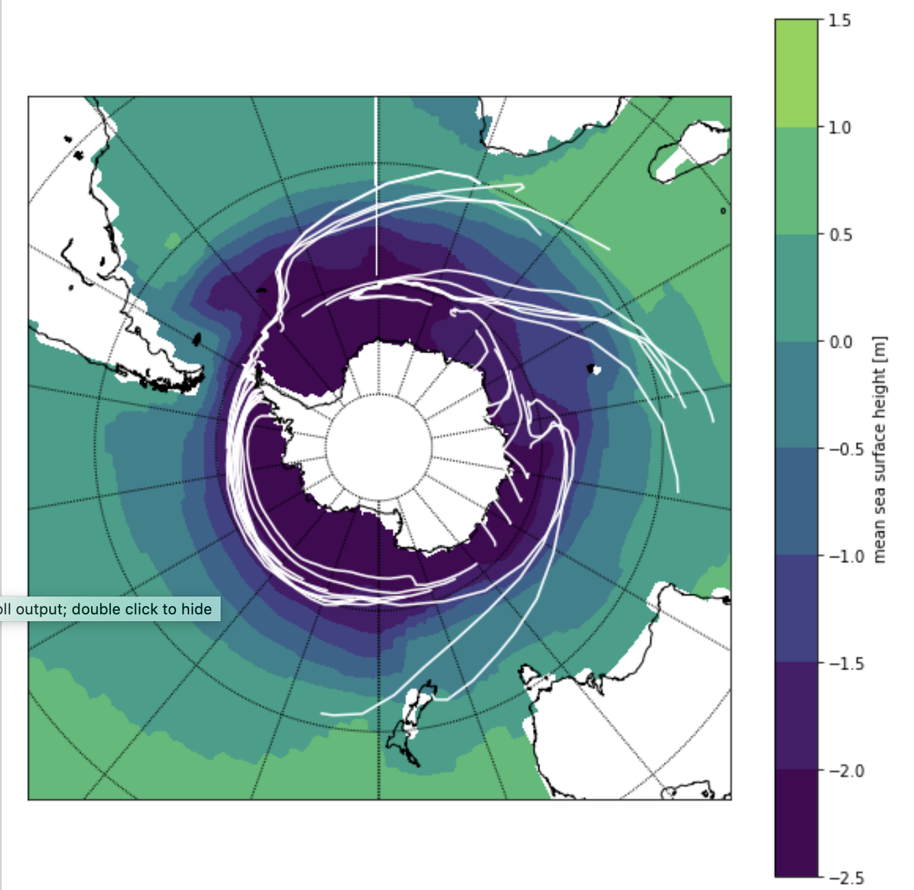

# pyberg, a simple iceberg drift and decay model in Python
Routines and notebooks for computing iceberg trajectories and melting offline

- so far supports reading (interpolated) forcing data from the COSMOS climate model and AWI-CM
- code is based on the Fortran code of FESOM-IB

The Fortran source can be found [here](https://swrepo1.awi.de/scm/viewvc.php/trunk/src/?root=fesom-ib), after registration at [swrepo1.awi.de](https://swrepo1.awi.de).

### pyberg manuscripts and code

The analysis for the submitted paper 

<em>'An Antarctic Iceberg Melt Driver of Glacial Deep Water-Mass Reorganizations' by
Aidan Starr, Ian R. Hall, Stephen Barker, Thomas Rackow, Xu Zhang, Sidney R. Hemming,
H.J.L van der Lubbe, Gregor Knorr, Melissa A. Berke, Grant R. Bigg, Alejandra Cartagena,
Francisco J. Jiménez-Espejo, Xun Gong, Jens Gruetzner, Nambiyathodi Lathika, Leah J.
LeVay, Rebecca S. Robinson, Martin Ziegler, and the Exp. 361 Science Party</em>

can be reproduced with the following Jupyter [notebook](pyberg_SouthernOceanLead_saveSST_MELT_TRAJ.ipynb).

### example plots using pyberg and COSMOS forcing

**Pre-industrial test over 20 years**. Using COSMO input data.

**Last glacial maximum test over 20 years**. Using COSMO input data.

